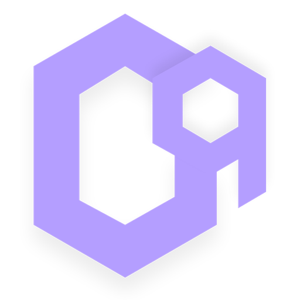

<div align="center">



# CodeBeing

**The AI developer studio — code, learn, explore.**

AI-powered code generation, interactive algorithm visualization, a growing template library, and a suite of developer tools — free, and offline-capable by design.

[](https://nextjs.org)
[](https://react.dev)
[](https://www.typescriptlang.org)
[](https://tailwindcss.com)
[](#license)
[](https://codebeing.vercel.app)

[Live Site](https://codebeing.vercel.app) · [Report a Bug](#) · [Request a Feature](#)

</div>

---

## Overview

CodeBeing is a browser-based developer studio built around one idea: you shouldn't need ten different tabs open to write, understand, and learn code. It brings AI-assisted code generation, algorithm visualization, hands-on challenges, and a curated template library into a single, fast, offline-resilient interface.

The AI chat/code-generation surface (**Codeground**) talks to a language model through a lightweight, provider-agnostic backend — so the model behind it can be swapped (Hugging Face Inference Providers, Groq, or any OpenAI-compatible endpoint) without touching the frontend. If the model is ever unreachable, CodeBeing degrades gracefully to an offline template-matching mode instead of failing outright.

## Features

| | |
|---|---|
| 🤖 **AI Code Generation** | Natural-language-to-code chat interface (`/codeground`) with streaming responses, language auto-detection, and an offline fallback that matches your prompt against the template library when the model is unavailable. |
| 🧠 **Algorithm Lab** | Interactive, visual walkthroughs of core algorithms and data structures (`/algorithm-lab`). |
| 📚 **Learn** | Structured, lesson-style content for programming fundamentals (`/learn`). |
| 🧩 **Templates** | A searchable library of ready-to-use code snippets and starters (`/templates`). |
| 🏆 **Challenges** | Practice problems (e.g. Two Sum and friends) to sharpen problem-solving (`/challenge`). |
| 🛝 **Playground** | A live sandbox for experimenting with code in the browser (`/playground`). |
| ✍️ **Blog** | Long-form technical writing — deep dives on topics like async/await and Big-O notation (`/blog`). |
| 🌱 **Contributions** | Open-source contribution tracking and highlights (`/contributions`). |
| 👥 **Team** | Meet the people building CodeBeing (`/team`). |

## Tech Stack

**Framework & Language**
- [Next.js 16](https://nextjs.org) (App Router) + [React 19](https://react.dev) + [TypeScript 5](https://www.typescriptlang.org)

**Styling & UI**
- [Tailwind CSS 4](https://tailwindcss.com) with a custom design-token system (`src/app/globals.css`)
- [shadcn/ui](https://ui.shadcn.com) ("new-york" style) on top of [Radix UI](https://www.radix-ui.com) primitives
- [Framer Motion](https://www.framer.com/motion/) for animation, [lucide-react](https://lucide.dev) for icons

**State & Data**
- [Zustand](https://zustand-demo.pmnd.rs) for client state
- [Prisma](https://www.prisma.io) + SQLite for persistence (`prisma/schema.prisma`)
- [Zod](https://zod.dev) + [react-hook-form](https://react-hook-form.com) for form validation

**AI Backend**
- `/api/generate` — a Next.js route handler that proxies chat completions to an OpenAI-compatible inference endpoint (Hugging Face Inference Providers by default), with built-in retry logic, per-IP rate limiting, and structured error codes.

**Other**
- `recharts` for data visualization, `sonner` for toasts, `lz-string` for compact URL state, `embla-carousel-react`, `react-resizable-panels`, `vaul`, `cmdk`.

## Getting Started

### Prerequisites

- Node.js `>= 18.18.0`
- npm `>= 9.0.0`

### Installation

```bash
git clone https://github.com/<your-org>/codebeing.git
cd codebeing
npm install
```

### Environment Variables

Create a `.env.local` file in the project root:

```bash
# Required — powers the AI chat/code-generation interface at /codeground
HF_API_KEY=your_huggingface_token

# Optional — override the default model (must support OpenAI-compatible chat completions)
HF_MODEL_ID=openai/gpt-oss-20b:groq

# Optional — override the inference endpoint entirely (e.g. to point at Groq, Together, or a custom host)
CHAT_API_BASE_URL=https://router.huggingface.co/v1/chat/completions

# Required if using Prisma locally
DATABASE_URL="file:./db/custom.db"
```

Get a Hugging Face token with **"Make calls to Inference Providers"** permission at [hf.co/settings/tokens](https://huggingface.co/settings/tokens).

### Run the dev server

```bash
npm run dev
```

Open [http://localhost:3000](http://localhost:3000).

### Other scripts

```bash
npm run build      # production build
npm run start       # run the production build
npm run lint         # lint the project
npm run lint:fix    # lint and auto-fix
```

## Project Structure

```
codebeing/
├── prisma/
│   └── schema.prisma         # SQLite schema (User, Post)
├── public/
│   ├── logo.png / logo.svg   # brand assets
│   └── ...
├── src/
│   ├── app/
│   │   ├── api/
│   │   │   ├── route.ts              # health check
│   │   │   └── generate/route.ts     # AI chat completions proxy
│   │   ├── algorithm-lab/
│   │   ├── blog/
│   │   ├── challenge/
│   │   ├── codeground/               # main AI chat / code-gen interface
│   │   ├── contributions/
│   │   ├── learn/
│   │   ├── playground/
│   │   ├── templates/
│   │   ├── team/
│   │   ├── sign-up/
│   │   ├── globals.css               # design-token system
│   │   └── layout.tsx                # root layout + SEO metadata
│   ├── components/
│   │   ├── ui/                       # shadcn/ui primitives
│   │   └── ...                       # feature components
│   ├── hooks/
│   ├── lib/
│   └── store/                        # Zustand stores
├── tailwind.config.ts
└── package.json
```

## How the AI Chat Works

1. The user types a prompt into the composer on `/codeground`.
2. The frontend `POST`s `{ input }` to `/api/generate`.
3. The route rate-limits by IP, then forwards the request as an OpenAI-compatible chat-completion call to the configured inference provider.
4. On success, it returns `{ generated_text }`, which streams into the UI.
5. On failure (rate limit, model unavailable, network error), it returns a structured `{ error, code }` — and the frontend falls back to matching the prompt against the local template library so the interface never goes silently blank.

This makes the model backend swappable — Hugging Face, Groq, or any OpenAI-compatible host — without any frontend changes.

## Contributing

Contributions are welcome. Please open an issue to discuss significant changes before submitting a pull request.

```bash
git checkout -b feature/your-feature
git commit -m "feat: describe your change"
git push origin feature/your-feature
```

## License

Distributed under the **MIT License**. See `LICENSE` for details.

## Team

Built by **Abhishek Shah**, Aachal Kumari, Chandan Sah, and Aman Poddar.

---

<div align="center">
<sub>CodeBeing — free, forever.</sub>
</div>
